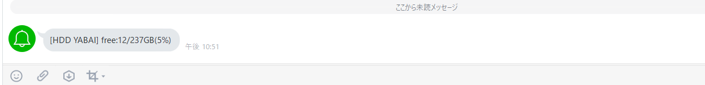
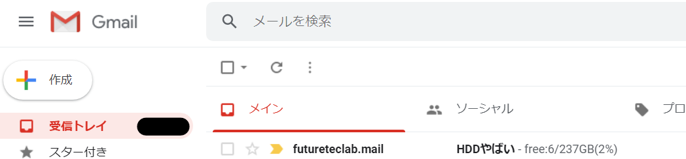

# HDDYabaiMonitor
## 概要
- ディスクの容量を調べて通知
- 通知先は(Line Notify/Discord Webhook/slack webhook/gmail)を選べる
- 通知先については、各通知先ごとに設定要

## 環境
- windows 10 64 bit
- python 3.5.2

## 使用方法
- config_sample.ini -> config.iniに変更

### 通知先設定
- 以下に通知したい先の必要情報を追記
- flagがTrueの場合通知
``` config.ini
[LINE]
flag = True
TOKEN = XXXXXXXXXXXXXXXXXXXXXXXXXXXXXXXXXXXXXXXXXXX

[discord]
flag = True
url = https://discordapp.com/api/webhooks/XXXXXXXXXXXXXXXXXX/XXXXXXXXXXXXXXXXXXXXXXXXXXXXXXXXXXXXXXXXXXXXXXXXXXXXXXXXXXXXXXXXXXXX

[slack]
flag = True
url = https://hooks.slack.com/services/XXXXXXXXX/XXXXXXXXX/XXXXXXXXXXXXXXXXXXXXXXXX

[gmail]
flag = True
from_email = XXXXXXXXXXXXXXXXX@gmail.com
from_password = XXXXXXXXXXXXXX
to_email = XXXXXXXXXX@gmail.com
subject = HDDやばい
``` 

### 監視先設定
- 容量を監視したいドライブを以下で指定
``` config.ini
[HDD]
yabai_path = C:
```

### 監視方法設定
- `yabai_loop = False`の場合、単発で容量を取得し通知
- `yabai_loop = True`の場合、`yabai_loop_intervalmin = 15`で指定分間隔で容量を取得、`yabai_gb = 10`の容量GBを下回った場合通知
``` config.ini
[HDD]
yabai_loop = False
yabai_gb = 10
yabai_loop_intervalmin = 15
```

### 実行方法
run_hdd_yabai_monitor.bat を実行

### 実行結果
- LINE Notify通知

- discord webhook通知

- slack webhook通知

- gmail 通知

